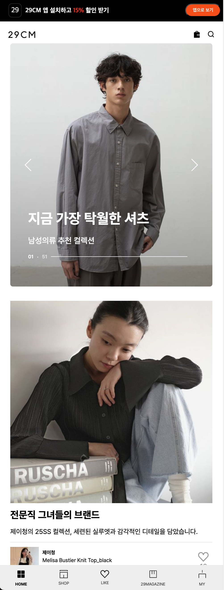

<div  >💎 <b>프로젝트를 소개합니다!</b> 💎
<br />
<hr />
<br />
<b>🎓 프로젝트 명</b> <br/ >
"29CM UI 프로젝트" <br/><br/>

<b>📝 프로젝트 소개</b><br/>
"온라인 패션 사이트인 29CM의 UI를 구현합니다."<br/>

<b>📅 프로젝트 기간</b><br/>
"2025.03.14 ~ 2025.03.25"<br/>

<b>🛠️ 기술 스택 / 협업 툴</b> <br/>

| 분류      | 툴                                                                                                                                                                                                                                                                                                                                                                            |
| --------- | ----------------------------------------------------------------------------------------------------------------------------------------------------------------------------------------------------------------------------------------------------------------------------------------------------------------------------------------------------------------------------- |
| 언어      |                                                                                                                                                                                                |
| 개발 환경 |                                                                                                                                                                |
| 협업      |     |
| 배포      |                                                                                                                                                                                                                                                                                |

<br />
<b>팀을 소개합니다!</b><br/>
<hr/>
팀명: <b>14K</b><br/>
<br/>

|                                     |                                       |                                  |                                      |
| :--------------------------------------------------------------------------------------------------------------------------: | :----------------------------------------------------------------------------------------------------------------------------: | :-----------------------------------------------------------------------------------------------------------------------: | :---------------------------------------------------------------------------------------------------------------------------: |
|                                                      팀장 <br/> 김진섭                                                       |                                                             김재현                                                             |                                                          문서인                                                           |                                                            유재희                                                             |
| [](https://github.com/jinseob92) | [](https://github.com/jaehyun0620) | [](https://github.com/SeOinm) | [](https://github.com/yoo-jaehee) |
|                                                      elso1234@naver.com                                                      |                                                       zzz6451@naver.com                                                        |                                                  anatjdls0716@gmail.com                                                   |                                                       uujhee@gmail.com                                                        |
|                                 완벽한 결과보다는 프로젝트 경험이 나의 성장에 도움되기를 !!                                  |                    과정을 중요시하며 협업을 통해 더 나은 서비스를 만들어가며 성장하는 개발자가 되겠습니다!                     |                                첫 협업이 좋은 기억으로 남을 것 같습니다. 앞으로도 화이팅!                                 |             능력 있는 팀원들과의 원활한 소통 덕분에 기분좋게 프로젝트를 진행할 수 있었습니다. 모두 감사해요 ! 😄              |
|                                   header-component, <br/> my-page, <br/> 29-Magazine 구현                                    |                  item-card-component, <br/> main-page, <br /> my-like-page, <br/> items-detail-component 구현                  |                                  login-page, <br/> best-item-page, <br/> woman-page 구현                                  |                           footer-component, <br/> shopping-bag-page, <br/> special-order-page 구현                            |

<br /> 
<br />

## 🎥 프로젝트 미리보기

🚀 배포 링크: [`배포된 사이트 URL`]

### 주요 화면


<br />
- 모바일 화면은 29CM의 원본 디자인을 반영해서 헤더, 푸터, 메인 카드, 네비게이션 바 컴포넌트를 각각 구현했습니다.
<br />
<br />

<video src="./src/images/readmeimages/mainvideo.mp4" width="600" controls loop autoplay muted></video>
<br />

- 화면 너비가 540px 이상일 경우, 웹 버전으로 변경되는 반응형 디자인을 적용했습니다. 다른 세부 페이지에도 동일한 반응형 스타일을 적용했습니다.

## 🔧 설치 및 실행 방법

### 1️⃣ 프로젝트 클론

```bash
git clone https://github.com/FRONTENDBOOTCAMP-13th/14K.git
```

### 2️⃣ 패키지 설치

```bash
npm install
```

### 3️⃣ 프로젝트 실행

```bash
npm run dev
```

## 💡 주요 기능

✅ **메인 화면** - 전체적인 쇼핑몰 메인 화면 및 배너 이미지 구현  
✅ **상품 상세 페이지** - 선택한 상품의 상세 정보 표시  
✅ **반응형 디자인** - 모바일 및 웹 환경 지원  
✅ **네비게이션** - 헤더 링크 클릭 시 해당 세부 페이지로 이동 가능

## 📂 폴더 구조

```bash
📦 14K
 ┣ 📂 public
 ┃ ┣ 📂 vite.svg
 ┃ ┗ 📂 font
 ┣ 📂 src
 ┃ ┣ 📂 common
 ┃ ┣ 📂 images
 ┃ ┣ 📂 components
 ┃ ┃ ┗ 📂 styles
 ┃ ┣ 📂 pages
 ┃ ┗ ┗ 📂 styles
 ┣ 📜 package.json
 ┣ 📜 package-lock.json
 ┣ 📜 vite.config.js
 ┣ 📜 README.md
 ┣ 📜 style.css
 ┗ 📜 index.html
```
